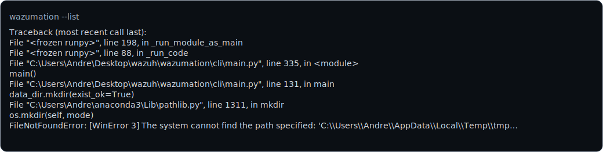
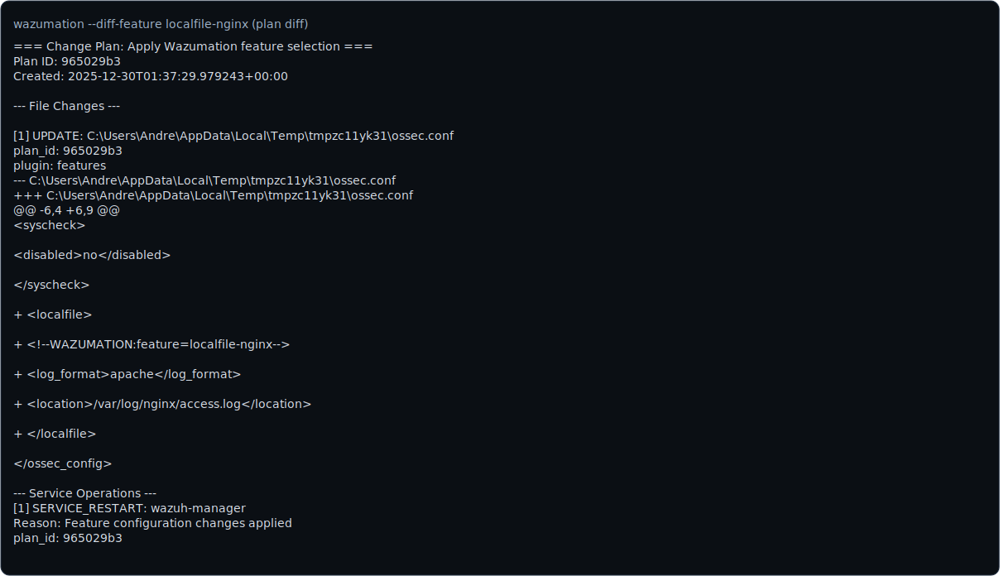
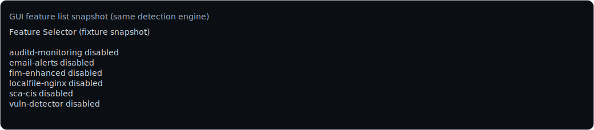
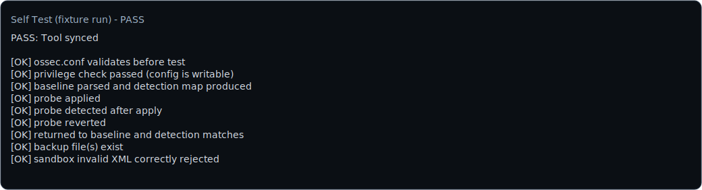

## Wazumation

Wazumation is a **local-only** configuration automation tool for **Wazuh managers**.

It provides:
- **Feature Selector (CLI + lightweight GUI)**: enable/disable a curated set of Wazuh configuration features by editing the **real** `ossec.conf` safely.
- **Self Test**: one command / one click to prove the tool is “synced” to the live configuration and can safely apply + detect + revert changes.

This repo also contains a full `ossec.conf` section/plugin system (`wazumation read/plan/diff/apply/...`) used for structured parsing and plan generation.

### Hard safety guarantees

- **Idempotent**: enabling the same feature repeatedly does not duplicate XML blocks.
- **Reversible**: disabling removes only what Wazumation added (marker-based removal for repeated blocks like `<localfile>`).
- **XML-aware**: `ossec.conf` parsing uses `lxml` + sanitization (handles extra trailing content / multiple `<ossec_config>` blocks).
- **Backups + audit**: plans are persisted, backups are created before writes, and actions are audit-logged.

## Requirements

- **Target host**: Wazuh **manager** (Linux) with real config at **`/var/ossec/etc/ossec.conf`** (default).
- **Python**: 3.9+ (recommended 3.10+)
- **Dependencies**: `lxml` (Tkinter GUI uses stdlib `tkinter`)

If you run feature toggles or self test on a non-manager node, Wazumation will fail clearly.

## Install (from source)

```bash
git clone https://github.com/ThreatRec0n/wazumation.git
cd wazumation
python -m venv .venv
source .venv/bin/activate
python -m pip install --upgrade pip
python -m pip install -e .
```

## Quickstart (Feature Selector)

### List available features

```bash
wazumation --list
```



### Show live status (reads real config)

```bash
wazumation --status
```


### Enable / disable (idempotent)

Enable:

```bash
wazumation --enable fim-enhanced,vuln-detector --approve-features
```

Disable:

```bash
wazumation --disable vuln-detector --approve-features
```

Notes:
- Use `--dry-run` to generate and validate a plan without changing anything.
- `--approve-features` is required to modify the live system (safety gate).

### Diff (feature)

```bash
wazumation --diff-feature localfile-nginx
```

This prints the **stored plan diff** for the last time the feature was applied (from the state file).



### GUI (lightweight)

```bash
wazumation --gui
```

Or:

```bash
wazumation-gui
```

The GUI shows the live detected status and lets you multi-select features and apply changes with logging output.



## Self Test (one command / one click)

The self test proves the tool is “synced” with the real Wazuh config by running an end-to-end pipeline:

1) Read live config and record a baseline (semantic hash + detected state map)
2) Apply a safe temporary probe change via the **same planner + applier** path as feature enable
3) Re-read and confirm the probe is detected
4) Revert via the **same disable** path
5) Re-read and confirm return-to-baseline
6) Run a sandbox invalid-XML safety gate (validator must reject bad XML)

Run from CLI:

```bash
wazumation test
```

Or:

```bash
wazumation --self-test
```

Run from GUI:
- Launch `wazumation --gui`
- Click **Self Test**

PASS means Wazumation can safely apply + detect + revert changes using the real parser/writer and validation gates. FAIL includes the phase, reason, and suggested remediation.



## Feature catalog (current)

| Feature ID | Description | What it changes |
|---|---|---|
| `fim-enhanced` | Syscheck hardening defaults | Updates `<syscheck>` keys (`scan_on_start`, `whodata`) |
| `auditd-monitoring` | Auditd ingestion template | Adds a `<localfile>` for `/var/log/audit/audit.log` |
| `vuln-detector` | Enable vuln detector | Ensures `<vulnerability-detection><enabled>yes</enabled>` |
| `sca-cis` | Enable SCA module | Ensures `<sca><enabled>yes</enabled>` |
| `localfile-nginx` | Nginx access log ingestion | Adds a `<localfile>` for `/var/log/nginx/access.log` |
| `email-alerts` | Email alerts | Prompts for SMTP settings and writes `<global>` keys |

## Backups, state, and logs

- **Plans**: `--data-dir/feature_plans/features-<id>.json`
- **Backups**: `--data-dir/backups/` (timestamped before writes)
- **Feature state**:
  - Linux preferred: `/var/lib/wazumation/state.json`
  - Otherwise: `~/.wazumation/state.json`
- **Audit log DB**: `--data-dir/audit.db`

## Verification checklist (recommended)

- Validate XML:

```bash
xmllint --noout /var/ossec/etc/ossec.conf
```

- After enable/disable:
  - `wazumation --status` shows expected enabled/disabled state
  - Re-running `--enable` does not duplicate blocks (idempotency)
  - `wazumation --disable` removes only Wazumation-marked blocks
  - `systemctl status wazuh-manager` is healthy (if you restart/reload)

## Development / tests

```bash
python -m pytest -q
```

This repo also includes tools to generate the documentation assets:

```bash
python tools/generate_docs_assets.py
```

## License

MIT

